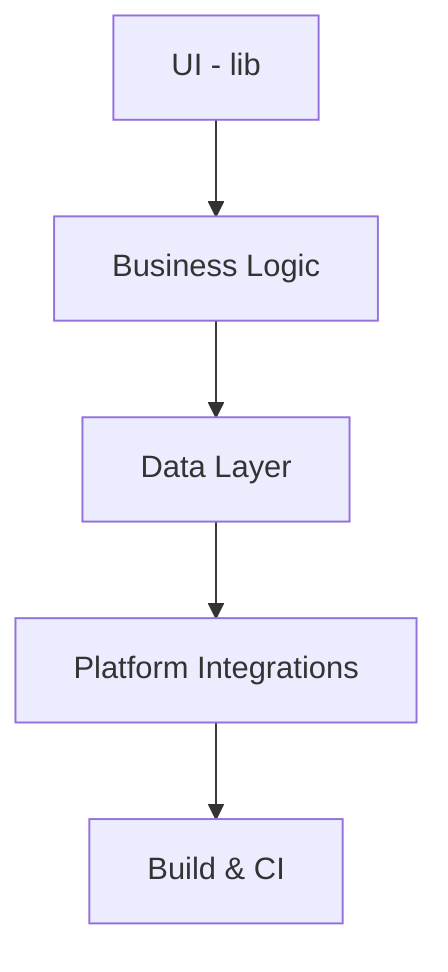

# Architecture & Agent Guidance (CLAUDE)

## Architecture diagram (conceptual)

Top-level components:

```
    [UI - Flutter (`lib/`)]
               |
    [Business Logic - services, controllers]
               |
    [Data Layer - local storage, assets]
               |
    [Platform Integrations - android/, ios/, web/, desktop/]
               |
    [Build & CI - workflows, release scripts]
```

Mermaid (simple):



## High-level responsibilities
- `lib/`: Flutter UI + app wiring. Keep widgets thin; move logic to services/providers.
- `android/`, `ios/`, `web/`, `linux/`, `macos/`, `windows/`: Platform packaging and native plugin code.
- `test/`: Widget and unit tests.

## Actionable items for developers and agents

- Read `CLAUDE.md` before making cross-cutting changes.
- Keep code comments minimal: prefer self-documenting code and a single-line comment when necessary. Agents should not expand comments into paragraphs.
- When documenting methods, reference parent class methods where relevant (e.g., "Overrides `ParentClass.method()` — see `ParentClass.method()` for contract").
- Add or update per-module `README.md` when you change module responsibilities or build steps.
- Use small, focused commits; include the issue/PR number in the commit message.

CI & testing
- Ensure new logic has focused unit tests in `test/` or module-specific test folders.
- Add CI jobs for platform-specific builds if adding native changes.

Documentation style for agents
- Minimal inline comments; prefer short Kdoc/Javadoc/Dartdoc lines where tooling generates documentation.
- When an agent writes docs about code, include an explicit `See:` link to the parent class or interface.

Agent tasks checklist (on PRs)
- Confirm architecture impact: which components changed.
- Verify minimal adequate tests added.
- Ensure per-module `README.md` updated if build or run steps changed.
